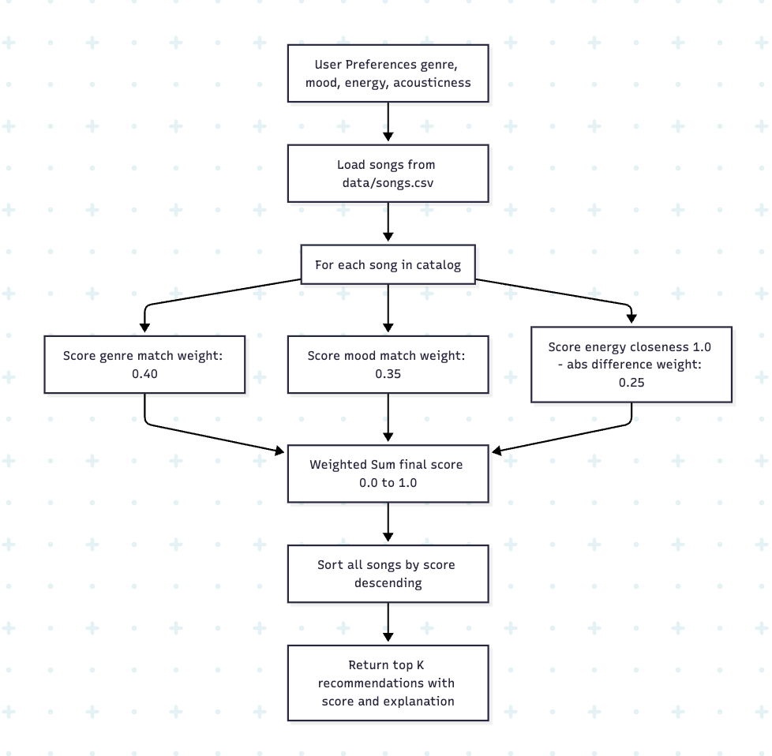
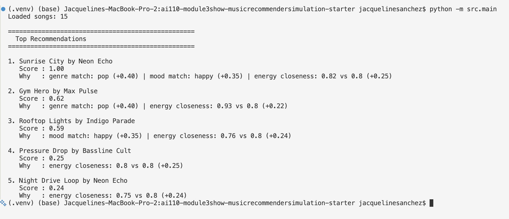
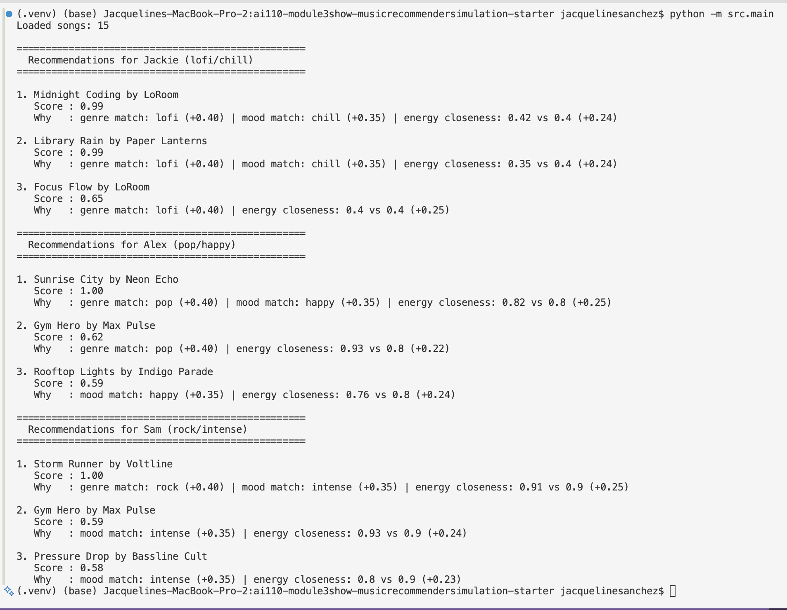
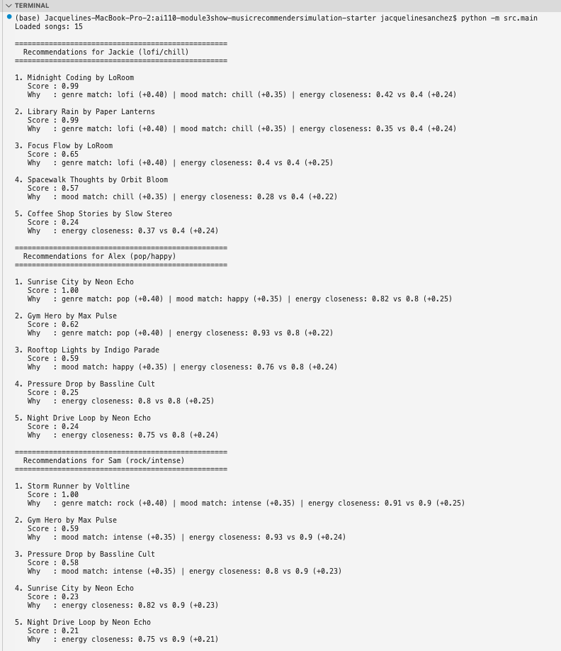
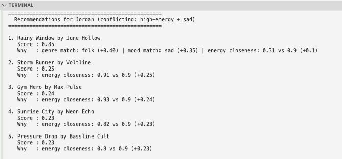
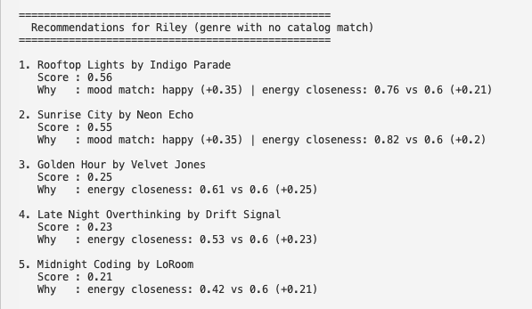
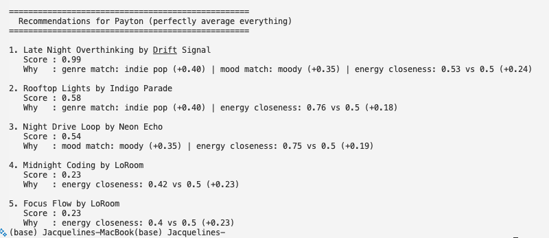

# 🎵 Music Recommender Simulation

## Project Summary

In this project you will build and explain a small music recommender system.

Your goal is to:

- Represent songs and a user "taste profile" as data
- Design a scoring rule that turns that data into recommendations
- Evaluate what your system gets right and wrong
- Reflect on how this mirrors real world AI recommenders

This simulation builds a content-based music recommender that scores songs from a small catalog against a user's taste profile. Given a user's preferred genre, mood, and energy level, it calculates a weighted score for each song and returns the top matches with a brief explanation of why each was chosen.

---

## How The System Works

Real-world platforms like Spotify and YouTube don’t just randomly suggest songs — they’re actually combining multiple strategies at once, which I thought was really interesting to dig into. They use collaborative filtering (looking at what similar users are listening to) and content-based filtering (analyzing what the song itself is like). At scale, they’re processing millions of interactions — plays, skips, saves — along with audio features like tempo, energy, and mood to build a pretty detailed picture of both the user and the music.

For my version, I focused on the content based side because I wanted to really understand how matching works at a more direct level like, if I say I like chill, low-energy music, how does the system actually find that?

**Song features used:**
- `genre` — broad style category (pop, lofi, rock, jazz, etc)
- `mood` — emotional tone (happy, chill, grunge, relaxed)
- `energy` — intensity level from 0.0 (very calm) to 1.0 (very hype)

**UserProfile stores:**
- Preferred `genre`, `mood`, and `energy` level

**Scoring logic:**
- Genre and mood matches award a full point (1.0) or nothing (0.0)
- Energy is scored by closeness: `1.0 - abs(song_energy - user_energy)`
- Final score = weighted sum: genre (0.40) + mood (0.35) + energy (0.25)

**Ranking:**
- All songs are scored, sorted highest to lowest, and the top `k` are returned with a brief explanation of why each matched.

**Data Flow:**


**Sample Output:**

The first version tested a single pop/happy user to verify the scoring logic was working correctly.


*Initial run: single user (pop/happy) to verify scoring logic*


After confirming the results made sense, I expanded the script to run recommendations for three users with different taste profiles — lofi/chill, pop/happy, and rock/intense — to see how the system behaves across different preferences.


*Updated run: three users with different taste profiles*

**Potential biases to watch for:**
- Genre gets the highest weight (0.40), so a great mood/energy match in the wrong genre will always rank lower — possibly burying songs the user would actually enjoy
- Mood matching is binary (match or no match), so "chill" and "relaxed" are treated as completely different even though they're close in feel
- The catalog is small and skewed — some genres have more songs than others, so certain profiles will always get more options to choose from (planning on adding more variety)

---

## Getting Started

### Setup

1. Create a virtual environment (optional but recommended):

   ```bash
   python -m venv .venv
   source .venv/bin/activate      # Mac or Linux
   .venv\Scripts\activate         # Windows

2. Install dependencies

```bash
pip install -r requirements.txt
```

3. Run the app:

```bash
python -m src.main
```

### Running Tests

Run the starter tests with:

```bash
pytest
```

You can add more tests in `tests/test_recommender.py`.

---

## Experiments You Tried

### Phase 4 — Stress Testing with Diverse Profiles

I ran the recommender against six profiles — three core and three edge cases to see where the scoring logic held up and where it broke down.

**Core profiles** (Jackie, Alex, Sam) all performed well, hitting scores of 0.99–1.00 with genre, mood, and energy all aligning cleanly.

*Jackie, Alex, Sam: core cases*

**Edge case profiles and what they revealed:**

**Jordan (conflicting: high-energy + sad, folk)**
This one was interesting — Jordan wants sad folk music but at a really high energy level (0.9), which is kind of an unusual combo. The system got the top pick right (*Rainy Window*, genre + mood match), but #2 and #3 were pure energy matches like *Storm Runner* and *Gym Hero*, which are completely off for someone in a sad mood. The problem is the system scores each feature on its own and doesn't consider whether they make sense together. One fix I'd want to try is treating mood as a hard filter — so songs that don't match the mood at all just get ruled out before ranking, no matter how well the energy lines up. Adding more sad high-energy songs to the catalog would also help give the system better options.


*Jordan: conflicting high-energy + sad profile*

**Riley (genre with no catalog match — reggae)**
Since there are no reggae songs in the catalog, every song started with 0 genre points and scores topped out around 0.56. The system still returned something, but the results felt weak and unconfident. It really highlights that genre is basically a scoring ceiling — if your genre isn't represented, you're at a disadvantage from the start. The clearest fix is just expanding the catalog with more variety. A longer-term idea would be to group similar genres together as a fallback (eg. reggae → world music) so the system can still find something reasonable when there's no exact match.


*Riley: reggae genre with zero catalog matches*

**Payton (perfectly average — indie pop/moody/energy 0.5)**
Even with a totally mid-range profile, Linh still got a 0.99 match because *Late Night Overthinking* happened to align on all three features at similar values. So "average" doesn't mean bad results — it just depends on what's in the catalog. This one showed me that catalog coverage matters just as much as how the weights are set up.


*Payton: perfectly average profile across all features*

---

## Limitations and Risks

- The catalog is small (18 songs) — users with niche tastes get fewer good matches
- Genre matching is a hard ceiling — if your genre isn't in the catalog, your max score drops to ~0.60
- Mood matching is binary — "chill" and "relaxed" are treated as completely different even though they're similar
- Features are scored independently — conflicting preferences (like sad mood + high energy) still return results that feel wrong
- The system doesn't say "I don't know" — it always returns something, even when the matches are weak

---

## Reflection

Read and complete `model_card.md`:

[**Model Card**](model_card.md)

Write 1 to 2 paragraphs here about what you learned:

- about how recommenders turn data into predictions
- about where bias or unfairness could show up in systems like this


---

## 7. `model_card_template.md`

Combines reflection and model card framing from the Module 3 guidance. :contentReference[oaicite:2]{index=2}  

```markdown
# 🎧 Model Card - Music Recommender Simulation

## 1. Model Name

Give your recommender a name, for example:

> VibeFinder 1.0

---

## 2. Intended Use

- What is this system trying to do
- Who is it for

Example:

> This model suggests 3 to 5 songs from a small catalog based on a user's preferred genre, mood, and energy level. It is for classroom exploration only, not for real users.

---

## 3. How It Works (Short Explanation)

Describe your scoring logic in plain language.

- What features of each song does it consider
- What information about the user does it use
- How does it turn those into a number

Try to avoid code in this section, treat it like an explanation to a non programmer.

---

## 4. Data

Describe your dataset.

- How many songs are in `data/songs.csv`
- Did you add or remove any songs
- What kinds of genres or moods are represented
- Whose taste does this data mostly reflect

---

## 5. Strengths

Where does your recommender work well

You can think about:
- Situations where the top results "felt right"
- Particular user profiles it served well
- Simplicity or transparency benefits

---

## 6. Limitations and Bias

Where does your recommender struggle

Some prompts:
- Does it ignore some genres or moods
- Does it treat all users as if they have the same taste shape
- Is it biased toward high energy or one genre by default
- How could this be unfair if used in a real product

---

## 7. Evaluation

How did you check your system

Examples:
- You tried multiple user profiles and wrote down whether the results matched your expectations
- You compared your simulation to what a real app like Spotify or YouTube tends to recommend
- You wrote tests for your scoring logic

You do not need a numeric metric, but if you used one, explain what it measures.

---

## 8. Future Work

If you had more time, how would you improve this recommender

Examples:

- Add support for multiple users and "group vibe" recommendations
- Balance diversity of songs instead of always picking the closest match
- Use more features, like tempo ranges or lyric themes

---

## 9. Personal Reflection

A few sentences about what you learned:

- What surprised you about how your system behaved
- How did building this change how you think about real music recommenders
- Where do you think human judgment still matters, even if the model seems "smart"

